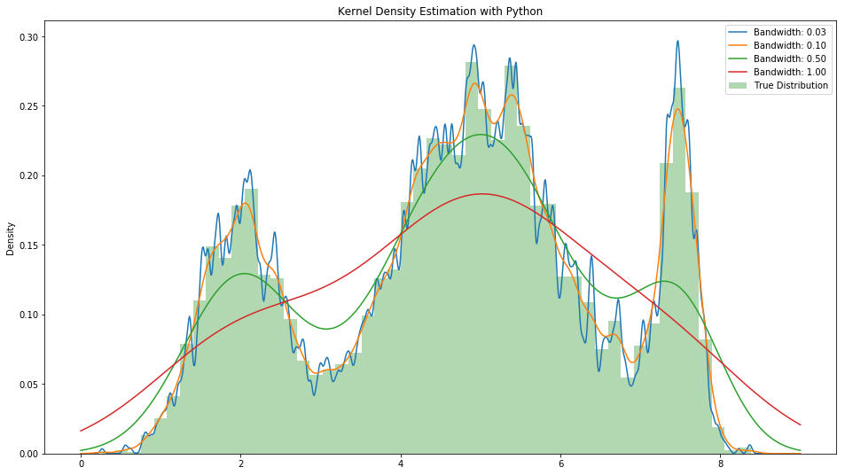

# Practical Kernel Density Estimation with S&P 500 Data

> #### Strength of mind rests in sobriety; for this keeps your reason unclouded by passion. 
>*Phythagoras*

## Introduction

I am reading a very interesting book - [The Physics of Wallstreet](https://www.amazon.com/Physics-Wall-Street-Predicting-Unpredictable/dp/0544112431 'link to Amazon page'), which talks about how mathematicians and physicists shaped the Wall Street we know today.

*(If you are interested in the stock market, you should read this brain-gasming gem.)*

One of the original super-heros in this book is Louis Bachelier - who was the first person to model the stock market fluctuations as Brownian motion (Normal Distribution, that is).

But twenty first century stock market returns are __NOT__ normally distributed, as seen in S&P 500, Dow Jones Index and many others.

Stock market are known to have "fat tail" events, where extreme market crashes and euphoria happens much more than what a Normal Distribution would predict.

This means, if we model S&P 500 daily returns as a Brownian Motion process following Bachelier's footsteps, we are going to be hugely surprized by market crashes and euphoria when we should not.

I attempted to use Kernel Density Estimation techniques to generate a PDF (Probability Density Function), and then estimate how likely the stock market is to crash from a day to day basis. (The KDE technique did a better job than a Normal Distribution.)

*(There are other ideas floating around, e.g. that stock market returns are Cauchy distributed - that will be for another notebook in the future. The purpose of this notebook is to demonstrate KDE using Python, and the data we use happens to be stock market returns)*

Dive into the Notebook [here](./Kernel-Density-Estimation-with-S&P-500-Data.ipynb).

> __Enjoy, keep calm & code in Python!__ 
> *OCY*
